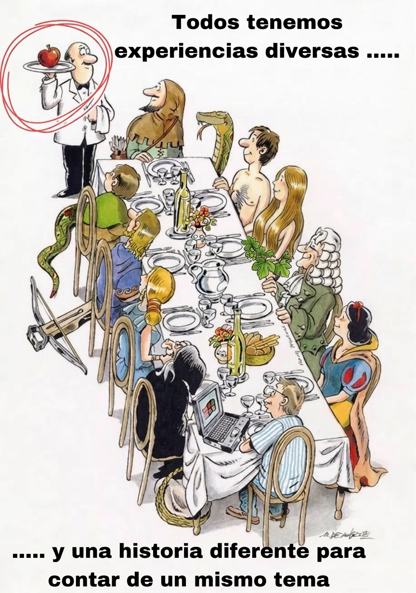

# 🧘 Storytelling con Datos

> **Todos tenemos experiencias diversas... y una historia diferente para contar sobre un mismo tema.**

  

---

## 🎯 ¿De qué hablamos cuando hablamos de Storytelling?

Hacer análisis no es solamente encontrar datos interesantes.

El verdadero desafío aparece cuando tenemos que **transformar esos datos en una historia que alguien pueda entender, recordar y, sobre todo, utilizar para tomar una decisión**.

Un buen storytelling conecta:

**Datos → Evidencia → Historia → Decisión → Acción**

Porque un gráfico puede ser correcto, sofisticado y estadísticamente impecable...

y aun así no decir absolutamente nada.

---

## 🌎 Un mismo mundo, muchas historias

### 🎬 200 países, 200 años

Una excelente demostración de cómo los datos pueden convertirse en una historia.

📺 **Video:** [200 países, 200 años — Andoni Arregui](VIDEO_URL)

La clave no está solamente en los datos utilizados, sino en **cómo se construye el relato alrededor de ellos**.

---

## 📚 Ejemplos de Storytelling

Para explorar distintas formas de contar historias con datos:

🔎 [Ejemplos de diferentes tipos de Storytelling](STORYTELLING_URL)

Hay muchas maneras de construir una narrativa: mapas, visualizaciones interactivas, líneas de tiempo, scrollytelling, narrativas audiovisuales y mucho más.

La herramienta puede cambiar.

**La pregunta y la historia son lo que importan.**

---

# 🧘 El Zen del Storytelling con Datos

A veces, **menos es más**.

Si todo es importante, nada lo es.

El objetivo no es mostrar todo lo que encontramos durante el análisis. El objetivo es **hacer visible aquello que realmente importa**.

### 1. 🎯 No cuentes todo lo que encontraste

Tu EDA fue interesante para vos.

Para el CEO... probablemente no.

El análisis completo puede quedar detrás de escena. La historia debe mostrar lo necesario para comprender el problema y tomar una decisión.

---

### 2. 📊 Un gráfico no es storytelling

Un gráfico se convierte en storytelling cuando ayuda a responder:

- ¿Qué pasó?
- ¿Por qué importa?
- ¿Qué deberíamos hacer ahora?

Sin contexto, incluso el gráfico más espectacular puede convertirse simplemente en decoración.

---

### 3. 🧭 Contexto antes que conclusión

Un número sin contexto es apenas un número con buena autoestima.

Antes de mostrar un dato, preguntate:

> **¿Respecto de qué?**

Comparar, contextualizar y establecer referencias permite que el dato tenga significado.

---

### 4. 🗣️ Los datos aportan evidencia; vos construís el argumento

Los datos no toman decisiones.

**Las personas toman decisiones.**

El storytelling es el puente entre la evidencia y la acción.

---

### 5. 🎨 No adornes: explica

Cada elemento visual debería tener un propósito.

Color.  
Tamaño.  
Posición.  
Texto.  
Animación.  
Gráfico.

Si un elemento no ayuda a entender la historia, probablemente sobra.

**El arcoíris no es una estrategia visual. 🌈**

---

### 6. 🚦 La historia tiene que llevar a algún lugar

Una buena historia debería cambiar al menos una de estas cosas:

- una decisión;
- una pregunta;
- una percepción;
- una acción.

Si el resultado final es solamente:

> *"Mirá qué interesante..."*

todavía no llegamos a la recomendación.

---

### 7. 🔍 Primero el mensaje, después el gráfico

No empieces preguntando:

> *"¿Qué gráfico puedo hacer?"*

Empezá preguntando:

> **"¿Qué quiero que la persona entienda?"**

Después elegí la visualización que mejor ayude a transmitir ese mensaje.

**Primero la pregunta. Después el gráfico. Nunca al revés.**

---

### 8. ✂️ Simplificar no es ocultar

Simplificar no significa esconder información.

Significa **quitar ruido para que aparezca la señal**.

No se trata de mostrar menos porque sí.

Se trata de mostrar mejor.

---

### 9. 👤 El protagonista no es el dashboard

El dashboard no es el producto final.

La visualización debería ayudar a una persona a:

- entender una situación;
- detectar un problema;
- identificar una oportunidad;
- tomar una decisión.

**El protagonista es la persona que tiene que decidir algo.**

---

### 10. 🧘 Si necesitás 20 minutos para explicar el gráfico...

...probablemente el gráfico necesite terapia.

Un buen gráfico no necesariamente evita toda explicación, pero debería **reducir la carga cognitiva**, no aumentarla.

Si necesitás 47 gráficos para demostrar un punto, quizás no tengas una historia.

Quizás tengas un inventario.

---

# 🧠 En resumen

El storytelling con datos no consiste en hacer visualizaciones bonitas.

Consiste en **construir una narrativa que transforme información en comprensión y comprensión en acción**.

> **No mostramos datos para impresionar.  
> Mostramos datos para que alguien pueda entender y decidir.**

---

## 🧘 Los 10 mandamientos

| # | Mandamiento |
|---|---|
| 1 | **Menos es más.** No todo lo que encontraste necesita ser contado. |
| 2 | **Una visualización no es una historia.** Necesita contexto, mensaje y propósito. |
| 3 | **Primero la pregunta, después el gráfico.** |
| 4 | **Si todo destaca, nada destaca.** |
| 5 | **El arcoíris no es una estrategia visual.** |
| 6 | **Los datos aportan evidencia; vos construís el argumento.** |
| 7 | **Una buena historia termina en una decisión o una acción.** |
| 8 | **Simplificar no es mentir.** Es eliminar ruido para hacer visible la señal. |
| 9 | **El protagonista no es el dashboard.** Es la persona que tiene que decidir. |
| 10 | **Si necesitás 20 minutos para explicar el gráfico, probablemente el gráfico necesite terapia.** |

---

## 💡 La idea para llevarse

**No se trata de contar todo lo que sabemos.**

Se trata de encontrar **qué vale la pena contar, por qué importa y qué debería pasar después**.

Porque todos podemos mirar los mismos datos.

Pero no necesariamente vamos a contar **la misma historia**.

Primero la pregunta, después el gráfico. No al revés. Nunca al revés. 😌
Si todo destaca, nada destaca. El arcoíris no es una estrategia visual.
Los datos aportan evidencia; vos construís el argumento.
Una buena historia termina en una decisión. “Mirá qué interesante” no es una recomendación.
Simplificar no es mentir. Es sacar ruido para que aparezca la señal.
El protagonista no es el dashboard. Es la persona que tiene que decidir algo.
Si necesitás 20 minutos para explicar el gráfico, probablemente el gráfico necesite terapia.
